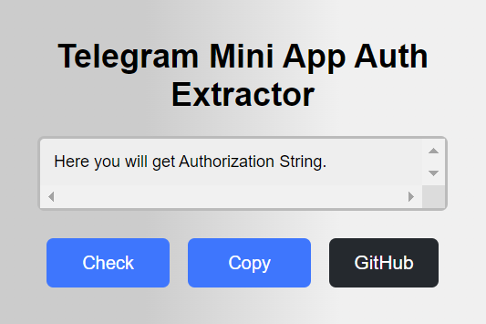
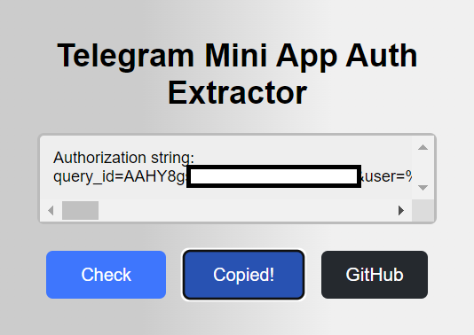
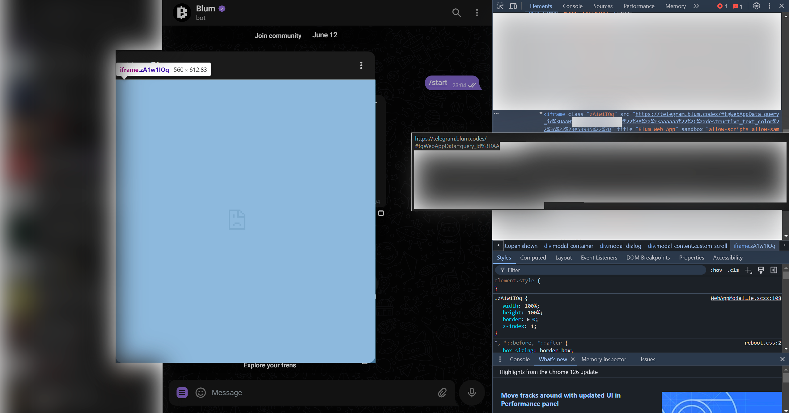
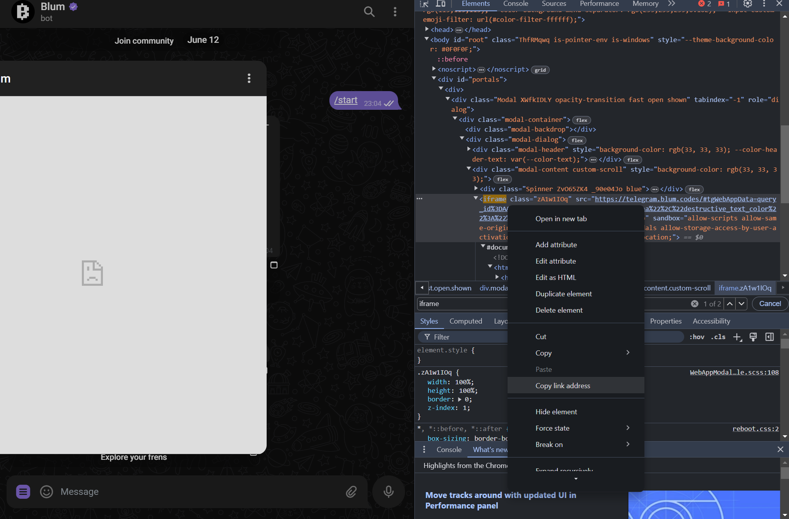

# Как достать авторизацию из любого Telegram Mini App
[EN](../en/getInitData.md) | [RU](getInitData.md)

Сейчас разберём, как быстро и легко достать авторизацию для любого мини-приложения в Телеграм, такого как Blum, Notcoin, Hamster Kombat или вообще любого другого, даже если в браузере оно не запускается.

### Пояснения
Телеграм всегда отправляет авторизацию мини-приложению. Авторизация эта работает по принципу "войти через Телеграм". К самому аккаунту Телеграм, разумеется, никакого доступа ни само приложение и его разработчики, ни мы, не получим! Так это не работает.

Разработчики самого мини-приложения или же сторонних программ для них получают доступ только к самому мини-приложению, но не к Телеграм.

Теперь, когда эти моменты мы обсудили, приступим к делу.

---

###  1.1 Веб-версия Телеграм
Нам понадобится именно она, так как данные хранятся на странице, а из браузера их легче всего достать. Вот ссылка.

- Заходим на сайт
- Входим в нужный аккаунт
- Заходим в нужный чат с ботом

### 1.2 Использование нашего расширения для браузера
Затем Вы можете использовать специальное расширение для браузера с открытым исходным кодом, написанное нами. Ссылка на расширение [здесь](https://chromewebstore.google.com/detail/telegram-mini-app-auth-ex/fjmkmlebpiodjmkpbpblflpgkmojigpm).

Оно абсолютно безопасно, прошло проверку от Google перед тем, как попасть в их магазин, и имеет открытый исходный код. Никаких других действий, кроме как по своему назначению, расширение не делает.

Установите его в свой браузер, затем перейдите на вкладку с Телеграм и обновите страницу, чтобы расширение заработало.

### 2 Запустите мини-приложение
Это что-то вроде кнопки в чате "Запустить", или же просто кнопка бокового меню (слева от области для набора сообщений). Тут, думаю, Вы прекрасно знаете, что делать.

### 3.1 Получение строки авторизации с расширением
Если Вы используете расширение, то просто откройте его и нажмите "Check", а затем скопируйте с помощью кнопки "Copy".

Графический интерфейс расширения

Графический интерфейс расширения с полученной авторизацией

### 3.2 Получение строки авторизации вручную
Если Вы не хотите устанавливать расширение, то можете получить строку авторизации вручную. Для этого:

- Нажмите по открывшемуся окну правой кнопкой мыши и выберите "Просмотреть код" (или же просто нажмите F12, чтобы перейти в инструменты разработчика)
- Нажмите Ctrl + F, чтобы включить поиск
- В поиске введите: iframe

В результате Вы получите примерно такую картину:

Как выглядит строка авторизации в инструментах разработчика

Нажмите правой кнопкой мыши по найденному элементу "<iframe..." и выберите "Скопировать адрес ссылки" ("Copy Link Address"):

Как выглядит панель для копирования ссылки в инструментах разработчика

---

### Готово!
Теперь у Вас есть ссылка, содержащая авторизацию.